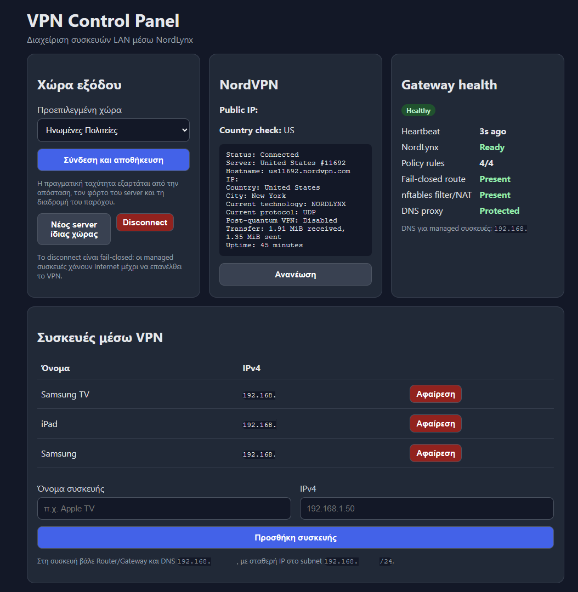

# NordVPN Linux Gateway Panel

Ubuntu gateway και LAN-only web panel για δρομολόγηση επιλεγμένων τηλεοράσεων, tablets, κονσολών και άλλων συσκευών μέσω NordVPN NordLynx.

Τρέχουσα έκδοση: **1.0.1**

## Βασικές λειτουργίες

- Προσθήκη και αφαίρεση managed συσκευών με IPv4
- Αλλαγή χώρας NordVPN από browser
- Policy routing ανά συσκευή
- nftables NAT και fail-closed προστασία
- Τοπικό dnsmasq proxy με τα upstream DNS queries υποχρεωτικά μέσω VPN
- Gateway heartbeat και health status στο web panel
- Ελεγχόμενη σειρά εκκίνησης μέσω systemd
- Transactional update με επαναφορά των προηγούμενων managed αρχείων σε αποτυχία
- Smoke test με προαιρετικό disconnect/reconnect του NordVPN

## Στιγμιότυπο του panel



## Προτεινόμενοι πόροι Ubuntu VM

```text
CPU:      2 vCPU
RAM:      2 GB
Swap:     1 GB
Δίσκος:   10 GB ελεύθερα
Δίκτυο:   1 External/Bridged network adapter
```

Σε Hyper-V χρησιμοποίησε **External Virtual Switch**. Η VM πρέπει να βρίσκεται στο ίδιο LAN με τις managed συσκευές και να έχει σταθερή IPv4 ή DHCP reservation.

## NordVPN authentication

Απαιτείται εγκατεστημένο και authenticated NordVPN Linux CLI:

```bash
nordvpn login
```

Για headless server:

```bash
nordvpn login --token
```

Το project δεν χρειάζεται WireGuard private key ή χειροκίνητο NordLynx configuration. Χρησιμοποιεί την υπάρχουσα authenticated συνεδρία του επίσημου NordVPN client.

## Απαιτούμενα NordVPN settings

Ο installer τα ρυθμίζει αυτόματα:

| Setting | Τιμή |
|---|---|
| Technology | `NORDLYNX` |
| Routing | `on` |
| Firewall | `on` |
| Kill Switch | `off` |
| LAN Discovery | `off` |
| Allowlist | Το ακριβές LAN subnet |
| Auto-connect | `on <country>` |

Ο installer εκτελεί τη μετάβαση LAN access μέσα από τοπικό transient systemd unit. Απενεργοποιεί το LAN Discovery και προσθέτει αμέσως το ακριβές subnet στην allowlist. Αν αποτύχει η allowlist, επαναφέρει το LAN Discovery. Το local unit συνεχίζει ακόμη και αν διακοπεί προσωρινά το SSH:

```bash
nordvpn set technology nordlynx
nordvpn set routing on
nordvpn set firewall on
nordvpn set killswitch off
nordvpn set lan-discovery off
nordvpn allowlist add subnet 192.168.1.0/24
```

## Ρύθμιση managed συσκευής

```text
IPv4:    Σταθερή/reserved IP στο LAN
Mask:    Συνήθως 255.255.255.0
Router:  IPv4 της Ubuntu VM
DNS:     IPv4 της Ubuntu VM
IPv6:    Off, εκτός αν έχει υλοποιηθεί αντίστοιχο IPv6 VPN routing
```

Παράδειγμα:

```text
Device IP:  192.168.1.50
Router:     192.168.1.2
DNS:        192.168.1.2
```

Το dnsmasq ακούει στη LAN IP της VM. Τα upstream DNS queries εκτελούνται από dedicated χρήστη και δρομολογούνται μέσω του fail-closed table `200`. Αν πέσει το `nordlynx`, τα DNS queries δεν επιστρέφουν στον κανονικό router.

## Εγκατάσταση

```bash
git clone https://github.com/vdionisopoulos/nordvpn-linux-gateway-panel.git
cd nordvpn-linux-gateway-panel
sudo ./install.sh
```

Panel:

```text
http://IP-ΤΗΣ-VM:8080
```

## Update

```bash
git pull --ff-only
sudo ./update.sh
```

Η έκδοση `1.0.1` ενημερώνει application, version metadata, systemd units, DNS configuration και runtime schema. Η fail-closed προστασία ξεκινά πριν από το DNS και το panel. Αν το update αποτύχει μετά τη δημιουργία backups, γίνεται προσπάθεια επαναφοράς των προηγούμενων managed αρχείων και services.

Για εγκατάσταση παλαιότερη από `0.3.0`, άλλαξε το DNS όλων των managed συσκευών ώστε να δείχνει στην IP της Ubuntu VM.

## Αυτόματος έλεγχος εγκατάστασης

Μη διακοπτικός έλεγχος:

```bash
sudo bash scripts/smoke-test.sh
```

Πλήρης έλεγχος fail-closed με προσωρινό disconnect/reconnect:

```bash
sudo bash scripts/smoke-test.sh --with-failover
```

Ο πλήρης έλεγχος επιβεβαιώνει ότι το DNS σταματά όταν πέσει το tunnel, ότι παραμένει η blackhole route και ότι DNS και routing επανέρχονται μετά το reconnect.

## Χειροκίνητος έλεγχος

```bash
sudo systemctl status tv-vpn-gateway.service --no-pager
sudo systemctl status vpn-control-dns.service --no-pager
sudo systemctl status vpn-control-web.service --no-pager
ip -4 rule show
ip -4 route show table 200
sudo nft list table inet tv_vpn
cat /run/vpn-control/gateway-health.json
```

DNS verification από managed συσκευή ή τοπικά στο gateway:

```bash
nslookup example.com IP-ΤΗΣ-VM
sudo tcpdump -ni eth0 'port 53'
sudo tcpdump -ni nordlynx 'port 53'
```

DNS requests από μη managed LAN hosts απορρίπτονται σκόπιμα από τα nftables.

## Uninstall

```bash
sudo ./uninstall.sh --panel-only
sudo ./uninstall.sh --all
sudo ./uninstall.sh --purge
```

## Releases

Το [CHANGELOG.md](CHANGELOG.md) περιγράφει τις εκδόσεις και το [stable release checklist](docs/release-checklist.md) τα απαιτούμενα release gates. Το tag `v1.0.1` ενεργοποιεί workflow που επαναλαμβάνει τους ελέγχους και δημιουργεί ZIP, tar.gz και SHA-256 checksums.

## Ασφάλεια

Μην κάνεις port forwarding της θύρας `8080` στο Internet. Τα πραγματικά credentials και runtime configuration παραμένουν μόνο τοπικά στα:

```text
/etc/vpn-control-web.env
/var/lib/vpn-control/config.json
/var/lib/vpn-control/install-state.json
```

## Άδεια

MIT
