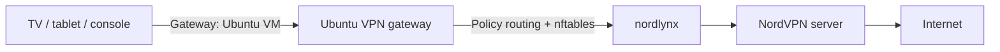

# NordVPN Linux Gateway Panel

A lightweight Ubuntu gateway and LAN-only web control panel for routing selected devices through NordVPN NordLynx.

It is useful for TVs, tablets, consoles, and other devices that cannot run the NordVPN application directly.

## Features

- Add and remove managed devices by IPv4 address
- Change the NordVPN exit country from a browser
- Persist the selected country as the NordVPN auto-connect target
- Reconnect to another server in the same country
- Source-based policy routing for multiple devices
- nftables masquerading
- Fail-closed routing when the VPN tunnel is unavailable
- systemd services for automatic startup
- HTTP Basic Authentication and CSRF protection

Supported menu countries currently include Greece, Bulgaria, Serbia, Romania, Italy, Austria, Germany, Spain, France, the Netherlands, the United Kingdom, the United States, South Korea, and Japan.

## Architecture



## Requirements

- Ubuntu Server with systemd
- A bridged or external virtual NIC on the same LAN as the managed devices
- NordVPN Linux CLI installed and authenticated
- NordLynx enabled
- A fixed IPv4 address for the Ubuntu gateway
- Fixed IPv4 addresses or DHCP reservations for managed devices

Before installation, confirm:

```bash
nordvpn status
ip -4 -br address
ip -4 route
```

## Installation

```bash
git clone https://github.com/vdionisopoulos/nordvpn-linux-gateway-panel.git
cd nordvpn-linux-gateway-panel
sudo ./install.sh
```

The installer detects the default LAN interface, gateway VM address, and connected subnet. It can also be configured with environment variables documented in the installation script.

Open the panel at:

```text
http://GATEWAY-IP:8080
```

## Managed device configuration

For each device added to the panel, configure:

```text
IPv4 address: a reserved address in the LAN subnet
Subnet mask:  according to the LAN, commonly 255.255.255.0
Router:       IPv4 address of the Ubuntu gateway
DNS:          103.86.96.100 or 103.86.99.100
```

Reserve the device address in the router. Disable IPv6 on the client, or implement equivalent IPv6 routing and filtering, so it cannot bypass the IPv4 VPN gateway.

## Updating

```bash
git pull
sudo ./update.sh
```

Runtime configuration and web credentials are preserved.

## Verification

```bash
sudo systemctl status tv-vpn-gateway.service --no-pager
sudo systemctl status vpn-control-web.service --no-pager
ip -4 rule show
ip -4 route show table 200
sudo nft list table inet tv_vpn
sudo nft list table ip tv_vpn_nat
```

## Security

The panel is designed for a trusted LAN. Do not expose its HTTP port to the Internet. HTTP Basic Authentication does not provide transport encryption; place the application behind a TLS reverse proxy if the network is not trusted.

## Disclaimer

This project is independent and is not affiliated with, endorsed by, or maintained by Nord Security. NordVPN and NordLynx are trademarks of their respective owners.

## License

MIT
