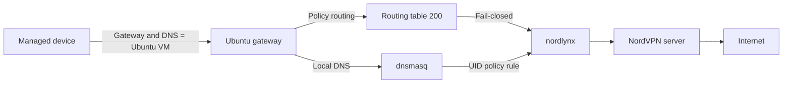

# NordVPN Linux Gateway Panel

A lightweight Ubuntu gateway and LAN-only web panel for routing selected TVs, tablets, consoles, and other devices through NordVPN NordLynx.

Current release: **1.0.0**

## Features

- Add and remove managed devices by IPv4 address
- Change the NordVPN exit country from a browser
- Source-based policy routing for multiple devices
- nftables forwarding, NAT, and fail-closed protection
- Local dnsmasq proxy with DNS traffic forced through the VPN routing table
- Gateway heartbeat and health visibility in the web panel
- systemd services with defensive hardening and ordered startup
- Transactional updates with managed-file rollback
- Installed-gateway smoke test, including optional VPN failover validation
- HTTP Basic Authentication, CSRF protection, and atomic configuration writes

## Architecture



## Requirements

### Ubuntu gateway

Recommended resources:

```text
CPU:      2 vCPU
Memory:   2 GB RAM
Swap:     1 GB
Storage:  10 GB free
Network:  1 bridged/external LAN adapter
```

The gateway requires Ubuntu Server with `systemd`, `bash`, `apt`, `sudo`, Linux policy routing, nftables, Python 3, and a fixed IPv4 address or DHCP reservation on the same LAN as the managed devices.

For virtualization, use an **External Virtual Switch** in Hyper-V, **Bridged Networking** in VMware, or a **Bridged Adapter** in VirtualBox. NAT-only and host-only networks are not suitable.

Example:

```text
LAN router:       192.168.1.1
Ubuntu gateway:   192.168.1.2
LAN subnet:       192.168.1.0/24
Web panel:        http://192.168.1.2:8080
```

### NordVPN account and Linux client

Install and authenticate the official NordVPN Linux CLI before running this project:

```bash
nordvpn login
```

For a headless server:

```bash
nordvpn login --token
```

The project does not require a raw WireGuard private key, manual NordLynx configuration, or OpenVPN service credentials. It uses the authenticated local NordVPN CLI session. See [NordVPN authentication and secret handling](docs/nordvpn-authentication.md).

### Required NordVPN settings

The installer configures these settings automatically:

| Setting | Required value | Reason |
|---|---|---|
| Technology | `NORDLYNX` | Provides the `nordlynx` tunnel |
| Routing | `on` | Keeps official client routing active |
| Firewall | `on` | Retains NordVPN client firewall protection |
| Kill Switch | `off` | This project provides per-device fail-closed protection |
| LAN Discovery | `off` | A precise LAN subnet allowlist is used instead |
| Allowlisted subnet | Exact LAN subnet | Preserves SSH, DNS, and web-panel LAN access |
| Auto-connect | `on <country>` | Restores the selected country after reboot |

The exact subnet is added **before** LAN Discovery is disabled, preventing an active SSH session from being locked out:

```bash
nordvpn allowlist add subnet 192.168.1.0/24
nordvpn set technology nordlynx
nordvpn set routing on
nordvpn set firewall on
nordvpn set killswitch off
nordvpn set lan-discovery off
```

### Managed-device configuration

Each managed device needs:

```text
IPv4 address:  Fixed/reserved address in the LAN subnet
Subnet mask:   Usually 255.255.255.0
Router:        Ubuntu gateway IPv4 address
DNS:           Ubuntu gateway IPv4 address
IPv6:          Disabled unless equivalent IPv6 VPN routing exists
```

Example:

```text
IPv4 address:  192.168.1.50
Router:        192.168.1.2
DNS:           192.168.1.2
```

The local dnsmasq proxy runs as a dedicated user. Its upstream DNS traffic is selected by a UID policy rule and sent through routing table `200`. If `nordlynx` is unavailable, the table's blackhole default prevents fallback to the normal router. See [Fail-closed DNS design](docs/dns.md).

## Pre-installation checks

```bash
nordvpn settings
nordvpn status
ip -4 -br address
ip -4 route
systemctl is-active nordvpnd
sudo ss -ltnup | grep -E ':(53|8080)\b' || true
```

Confirm that NordVPN is authenticated, the VM has its expected fixed address, `nordvpnd` is active, and ports `53` on the gateway LAN address and `8080` are available.

## Installation

```bash
git clone https://github.com/vdionisopoulos/nordvpn-linux-gateway-panel.git
cd nordvpn-linux-gateway-panel
sudo ./install.sh
```

Optional overrides:

```bash
sudo VPN_USER="$USER" \
     LAN_IF=eth0 \
     BIND_IP=192.168.1.2 \
     LAN_NET=192.168.1.0/24 \
     WEB_PORT=8080 \
     WEB_USER=admin \
     WEB_PASSWORD='use-a-strong-password' \
     DEFAULT_COUNTRY=gr \
     ./install.sh
```

Open `http://GATEWAY-IP:8080`.

## Updating

```bash
git pull --ff-only
sudo ./update.sh
```

The updater refreshes the application, version metadata, dependencies, gateway script, all systemd units, dnsmasq configuration, and runtime schema. It runs `systemctl daemon-reload`, validates the units, starts fail-closed gateway protection before DNS and the panel, and verifies the protected health state before declaring success.

Managed files are backed up before replacement. If the update fails after that point, the updater restores the previous managed files and attempts to restart the previous services. Only the five newest backups per managed file are retained.

### Upgrade from versions before 0.3.0

Version `0.3.0` introduced the DNS proxy. After updating, configure every managed device with:

```text
DNS = Ubuntu gateway IPv4 address
```

## Installed-gateway validation

Run the non-disruptive smoke test:

```bash
sudo bash scripts/smoke-test.sh
```

For a complete release or maintenance validation that temporarily disconnects and reconnects NordVPN:

```bash
sudo bash scripts/smoke-test.sh --with-failover
```

The failover test verifies that DNS stops when the tunnel is unavailable, the blackhole route remains, the VPN route is removed, and DNS/routing recover after reconnect.

## Manual verification

```bash
sudo systemctl status tv-vpn-gateway.service --no-pager
sudo systemctl status vpn-control-dns.service --no-pager
sudo systemctl status vpn-control-web.service --no-pager
ip -4 rule show
ip -4 route show table 200
sudo nft list table inet tv_vpn
sudo nft list table ip tv_vpn_nat
cat /run/vpn-control/gateway-health.json
```

DNS checks:

```bash
nslookup example.com GATEWAY-IP
sudo tcpdump -ni eth0 'port 53'
sudo tcpdump -ni nordlynx 'port 53'
```

## Health model

The gateway writes an atomic heartbeat to `/run/vpn-control/gateway-health.json`. The panel reports heartbeat freshness, NordLynx availability, policy-rule counts, the blackhole route, nftables filter/NAT state, and DNS proxy protection. A disconnected tunnel with all guards intact is shown as **Fail-closed**.

## Uninstall modes

```bash
sudo ./uninstall.sh --panel-only
sudo ./uninstall.sh --all
sudo ./uninstall.sh --purge
```

`--panel-only` keeps routing and DNS. `--all` removes services, rules, routes, and nftables state while preserving runtime configuration. `--purge` also removes runtime state and installer-created memberships/users where applicable.

## Development and CI

```bash
python3 -m pip install -r requirements.txt -r requirements-dev.txt
ruff check .
pytest
shellcheck -x gateway.sh install.sh update.sh uninstall.sh scripts/smoke-test.sh
bash -n gateway.sh install.sh update.sh uninstall.sh installer-lib.sh scripts/smoke-test.sh
```

CI also validates the rendered nftables ruleset with `nft -c -f` and verifies the systemd units.

## Releases

See [CHANGELOG.md](CHANGELOG.md) for release history and [the stable release checklist](docs/release-checklist.md) for release gates. A signed tag such as `v1.0.0` triggers a validated release workflow that creates ZIP and tar.gz archives plus SHA-256 checksums.

## Security

Never commit:

```text
/etc/vpn-control-web.env
/var/lib/vpn-control/config.json
/var/lib/vpn-control/install-state.json
```

The panel is intended for a trusted private LAN. Do not expose port `8080` to the Internet. HTTP Basic Authentication does not encrypt credentials; use a TLS reverse proxy when the LAN is not trusted.

## Disclaimer

This project is independent and is not affiliated with, endorsed by, or maintained by Nord Security. NordVPN and NordLynx are trademarks of their respective owners.

## License

MIT
