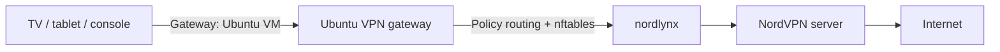

# NordVPN Linux Gateway Panel

A lightweight Ubuntu gateway and LAN-only web control panel for routing selected devices through NordVPN NordLynx.

It is useful for TVs, tablets, consoles, and other devices that cannot run the NordVPN application directly.

## Features

- Add and remove managed devices by IPv4 address
- Change the NordVPN exit country from a browser
- Persist the selected country as the NordVPN auto-connect target
- Reconnect to another server in the same country
- Source-based policy routing for multiple devices
- nftables masquerading
- Fail-closed routing when the VPN tunnel is unavailable
- systemd services for automatic startup
- HTTP Basic Authentication and CSRF protection

Supported menu countries currently include Greece, Bulgaria, Serbia, Romania, Italy, Austria, Germany, Spain, France, the Netherlands, the United Kingdom, the United States, South Korea, and Japan.

## Architecture



## Requirements

### Ubuntu gateway host

The gateway can run on a physical Ubuntu machine or on a virtual machine. The intended deployment is a small, always-on Ubuntu Server instance.

Recommended resources for a few TVs, tablets, or streaming devices:

```text
CPU:      2 virtual CPUs
Memory:   2 GB RAM
Swap:     1 GB
Storage:  10 GB free disk space
Network:  1 Ethernet or virtual network adapter
```

The application itself uses very few resources. VPN encryption throughput depends mainly on the host CPU, the Internet connection, and the selected NordVPN server.

The operating system must provide:

- Ubuntu Server with `systemd`, `bash`, `apt`, and `sudo`
- IPv4 forwarding support
- Linux policy routing through `ip rule` and custom routing tables
- nftables support for forwarding, filtering, and source NAT
- Python 3 with virtual-environment support

The installer installs the required Ubuntu packages, including Python, `jq`, `nftables`, and supporting utilities.

### Virtual-machine networking

When the gateway runs as a VM, its network adapter must connect directly to the same LAN as the managed devices.

Examples:

- Hyper-V: use an **External Virtual Switch**
- VMware: use **Bridged Networking**
- VirtualBox: use a **Bridged Adapter**

A NAT-only or host-only virtual network is not suitable because TVs and other LAN devices must be able to reach the Ubuntu VM directly.

The VM must have:

- A fixed IPv4 address or a permanent DHCP reservation
- An address in the same IPv4 subnet as the managed devices
- A working default route through the normal LAN router
- Internet access before NordVPN is configured
- A LAN interface name that can be detected by the installer, such as `eth0`, `ens18`, or `enp0s3`

Example:

```text
LAN router:       192.168.1.1
Ubuntu gateway:   192.168.1.2
LAN subnet:       192.168.1.0/24
Web panel:        http://192.168.1.2:8080
```

Port `8080` must be unused on the Ubuntu host. Do not create an Internet-facing port-forward for this port.

### NordVPN account and Linux client

Before installing this project, the official NordVPN Linux CLI must already be installed and authenticated.

Required state:

- An active NordVPN account
- NordVPN Linux CLI installed
- Successful `nordvpn login`
- NordLynx selected as the VPN technology
- The Linux user running the web service added to the `nordvpn` group
- A successful test connection to at least one country

Recommended verification:

```bash
nordvpn settings
nordvpn status
ip -4 address show nordlynx
```

NordVPN should report `NORDLYNX` as the current technology, and the `nordlynx` interface should appear after connection.

### Router and LAN requirements

The LAN router should support DHCP reservations or another method for keeping device IPv4 addresses stable.

No router-wide static route is required. Each managed device is configured to use the Ubuntu VM as its own IPv4 default gateway.

The router and LAN must allow direct communication between:

```text
Managed device <-> Ubuntu gateway <-> LAN router
```

Client isolation or guest-network isolation must not block access from the managed device to the Ubuntu gateway.

### Managed-device requirements

Each TV, tablet, console, or other managed device needs:

- A fixed IPv4 address or DHCP reservation
- An IPv4 address in the same subnet as the Ubuntu gateway
- The Ubuntu gateway IPv4 address configured as its router/default gateway
- A working DNS server, such as NordVPN DNS
- IPv6 disabled or separately routed and filtered

Example device configuration:

```text
IPv4 address:  192.168.1.50
Subnet mask:   255.255.255.0
Router:        192.168.1.2
DNS:           103.86.96.100
Alternative:   103.86.99.100
```

IPv6 must be disabled on the managed device unless equivalent IPv6 VPN routing is implemented. Otherwise, a device may bypass the IPv4-only gateway.

### Administrative access

Installation requires:

- A Linux user with `sudo` privileges
- SSH or local console access to the Ubuntu gateway
- Permission to install packages and systemd services
- Permission to manage routes, nftables, and IPv4 forwarding

The web panel is intended for use only from a trusted private LAN.

### Pre-installation checks

Run these commands before installation:

```bash
nordvpn status
ip -4 -br address
ip -4 route
systemctl is-active nordvpnd
sudo nft list ruleset
sudo ss -ltn | grep ':8080' || true
```

Confirm that:

- NordVPN can connect successfully
- The Ubuntu gateway has the expected fixed LAN address
- The default route points to the normal LAN router
- `nordvpnd` is active
- Port `8080` is not already in use

## Installation

```bash
git clone https://github.com/vdionisopoulos/nordvpn-linux-gateway-panel.git
cd nordvpn-linux-gateway-panel
sudo ./install.sh
```

The installer detects the default LAN interface, the gateway VM IPv4 address, and the connected subnet. Override them when necessary:

```bash
sudo VPN_USER="$USER" \
     LAN_IF=eth0 \
     BIND_IP=192.168.1.2 \
     LAN_NET=192.168.1.0/24 \
     WEB_PORT=8080 \
     WEB_USER=admin \
     WEB_PASSWORD='use-a-strong-password' \
     DEFAULT_COUNTRY=gr \
     ./install.sh
```

Open the panel at:

```text
http://GATEWAY-IP:8080
```

## Managed device configuration

For each device added to the panel, configure:

```text
IPv4 address: a reserved address in the LAN subnet
Subnet mask:  according to the LAN, commonly 255.255.255.0
Router:       IPv4 address of the Ubuntu gateway
DNS:          103.86.96.100 or 103.86.99.100
```

Reserve the device address in the router. Disable IPv6 on the client, or implement equivalent IPv6 routing and filtering, so it cannot bypass the IPv4 VPN gateway.

## Updating

```bash
git pull
sudo ./update.sh
```

Runtime configuration and web credentials are preserved.

## Verification

```bash
sudo systemctl status tv-vpn-gateway.service --no-pager
sudo systemctl status vpn-control-web.service --no-pager
ip -4 rule show
ip -4 route show table 200
sudo nft list table inet tv_vpn
sudo nft list table ip tv_vpn_nat
```

Traffic inspection:

```bash
sudo tcpdump -ni eth0 host CLIENT_IP
sudo tcpdump -ni nordlynx
```

## Runtime files

These files contain local state or secrets and must not be committed:

```text
/etc/vpn-control-web.env
/var/lib/vpn-control/config.json
```

## Security

The panel is designed for a trusted LAN. Do not expose its HTTP port to the Internet. HTTP Basic Authentication does not provide transport encryption; place the application behind a TLS reverse proxy if the network is not trusted.

## Disclaimer

This project is independent and is not affiliated with, endorsed by, or maintained by Nord Security. NordVPN and NordLynx are trademarks of their respective owners.

## License

MIT
