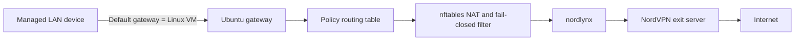

# Architecture

The control plane consists of a small Flask/Gunicorn web application. Device inventory and the selected country are stored in the runtime configuration file under `/var/lib/vpn-control/`. The root gateway service watches that file and reconciles policy routing and nftables state.

The web service runs as the configured non-root Linux user and accesses the NordVPN daemon through membership in the `nordvpn` group. The routing service runs as root because it manages kernel routes and nftables.
